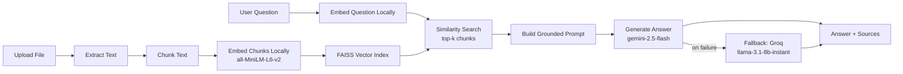

# 📄 DocuChat AI - Retrieval-Augmented Q&A over Your Documents

A Retrieval-Augmented Generation (RAG) app that lets you upload a document (`.txt`, `.pdf`, `.docx`, `.csv`, `.xlsx`) and ask questions about it in a chat interface. Answers are grounded strictly in the document's content, with the exact source chunks shown for every response.

**🔗 Live demo:** [docuchat-ai-rag.streamlit.app](https://docuchat-ai-rag.streamlit.app/)

---

## ✨ Features

- **Multi-format support**: plain text, PDF, Word, CSV, and Excel files
- **Chat-style interface**: with full conversation history
- **Transparent retrieval**: every answer shows the exact chunks it was grounded in, with similarity distance
- **Smart chunking**: tabular data (CSV/XLSX) uses larger, low-overlap chunks to keep rows intact; prose uses smaller, denser chunks for tighter semantic matches
- **Session-level caching**: a document is embedded once per session; asking follow-up questions doesn't re-embed the same file
- **Local embeddings**: no external embedding API in the request path, so nothing to rate-limit, time out, or run out of quota mid-conversation
- **Automatic generation fallback**: if Gemini's free-tier quota is exhausted mid-chat, answers automatically retry on Groq instead of failing
- **Clear failure states**: missing API key, unsupported file type, or empty document all produce readable errors instead of crashes

---

## 🏗️ Architecture



**Pipeline stages:**

1. **Ingestion** - `file_loader.py` extracts raw text from the uploaded file.
2. **Chunking** - the text is split into overlapping windows (size depends on file type).
3. **Embedding** - each chunk is converted into a dense vector **locally**, via `sentence-transformers`, no external API call for this step.
4. **Indexing** - vectors are stored in an in-memory FAISS `IndexFlatL2` store.
5. **Retrieval** - the user's question is embedded and matched against the top-k closest chunks.
6. **Generation** - Gemini's `gemini-2.5-flash` answers using only the retrieved chunks as context. If that call fails for any reason (most commonly a free-tier quota limit), the same prompt is automatically retried on Groq's `llama-3.1-8b-instant` instead, so the chat keeps working rather than showing an error mid-conversation.

---

## 📁 Project Structure

```
docuchat-ai/
├── app.py                          # Streamlit UI (entry point)
├── rag_engine.py                   # Core RAG logic: chunk / local embed / index / retrieve / generate (+ Groq fallback)
├── file_loader.py                  # Text extraction for txt/pdf/docx/csv/xlsx
├── requirements.txt
├── LICENSE
├── .gitignore
└── .streamlit/
    ├── config.toml                 # Theme
    └── secrets.toml.example        # Template — copy to secrets.toml, never commit the real one
```

Separating the engine from the UI means the RAG logic can be reused in a CLI tool, a notebook, or a different frontend without touching a single Streamlit call.

---

## 🚀 Running Locally

**1. Clone and install dependencies**

```bash
git clone https://github.com/HananAIBuilds/docuchat-ai.git
cd docuchat-ai
python -m venv venv
source venv/bin/activate      # Windows: venv\Scripts\activate
pip install -r requirements.txt
```

**2. Add your API key(s)**

```bash
cp .streamlit/secrets.toml.example .streamlit/secrets.toml
# then edit .streamlit/secrets.toml and paste your key(s)
```

You'll need one required key, and one optional fallback key:
- **Google API key** (required) - [Google AI Studio](https://aistudio.google.com/apikey), used for answer generation
- **Groq API key** (optional, recommended) - [Groq Console](https://console.groq.com/keys), used only as an automatic fallback if Gemini's quota is exhausted. Without it, the app still works, but a Gemini quota hit will pause answers instead of transparently switching models.

No HuggingFace token is required, embeddings run locally on-device via `sentence-transformers`, not through a hosted API.

**3. Run the app**

```bash
streamlit run app.py
```

The first run downloads the embedding model (~90MB), expect a short one-time delay before it's ready.

---

## ☁️ Deploying to Streamlit Cloud

1. Push this repo to GitHub (make sure `.streamlit/secrets.toml` is **not** committed, it's already in `.gitignore`).
2. Go to [share.streamlit.io](https://share.streamlit.io) → **New app** → select your repo, branch, and `app.py` as the entry point.
3. Under **Advanced settings → Secrets**, paste:
   ```toml
   GOOGLE_API_KEY = "your-google-api-key-here"
   GROQ_API_KEY = "your-groq-api-key-here"
   ```
   (`GROQ_API_KEY` is optional but recommended, see above.)
4. Deploy.

After deploying, do a couple of sanity checks: open the app fresh and time the cold start (the embedding model downloads on first load, typically ~10-20 seconds), confirm it doesn't hit Streamlit Cloud's free-tier memory ceiling (`all-MiniLM-L6-v2` is ~90MB, well within the 1GB limit, but worth confirming on your own deploy), and check the sidebar shows both API keys as loaded.

---

## ⚠️ Design Decisions & Known Limitations

**Embeddings run locally - this went through two other providers first.** The app originally used Gemini's own embedding model, sharing one API key/quota with generation. Every chunk of every uploaded document needs its own embedding call, so that quota got burned through fast — and once it was exhausted, the entire app stalled: no embeddings meant nothing to search, which meant no answers, even though the generation quota itself was untouched.

The first fix moved embeddings to HuggingFace's hosted Inference API, which solved the shared-quota problem but introduced a different one: that hosted endpoint intermittently returns `504` (server busy/timeout) errors under load. Not constantly, but often enough that it's an acceptable risk for a script you re-run yourself, and not an acceptable one for a deployed app a visitor might hit at the wrong moment.

Embeddings now run **locally** via `sentence-transformers`, removing the external API call from this step entirely, nothing left to rate-limit, time out, or run out of quota on. The trade-off is a slightly longer cold start on first load (the model downloads once) and a small, fixed memory footprint, both acceptable at this project's scale.

**Generation has an automatic fallback, because the free-tier quota is genuinely small.** Generation stayed on Gemini's `gemini-2.5-flash`, since embeddings, not generation, were the original bottleneck. But Gemini's free tier caps out at a low number of requests per day, and generation runs on every single chat message, so a normal back-and-forth conversation can exhaust it within a handful of questions. Rather than let that surface as a raw exception mid-chat, `generate_answer()` catches any Gemini failure and automatically retries the same prompt on Groq's `llama-3.1-8b-instant`. If no Groq key is configured, or Groq also fails, the user gets a short, honest message instead of a crash or a stack trace.

**Not built for counting/aggregation.** RAG retrieves only the top-k most relevant chunks, never the whole document. A question like *"how many rows have value X?"* will only reflect the rows inside the retrieved chunks, not the full dataset. This tool is best suited for *"find this specific fact"* questions, not full-dataset statistics.

**Processing time scales with file size.** Each chunk requires one embedding call; very large documents take longer to process.

**In-memory index.** The FAISS index lives in the Streamlit session, it resets if the app restarts or the session ends. There's no persistent vector database (yet).

**Answer quality depends on retrieval quality.** If the top-k chunks don't contain the answer, the model is instructed to say so rather than guess, but retrieval isn't perfect.

---

## 🧰 Tech Stack

| Layer | Tool |
|---|---|
| UI | Streamlit |
| Embeddings | `sentence-transformers` (`all-MiniLM-L6-v2`), local inference |
| Generation | Google Gemini (`gemini-2.5-flash`), with automatic fallback to Groq (`llama-3.1-8b-instant`) |
| Vector search | FAISS (`IndexFlatL2`) |
| File parsing | `pypdf`, `python-docx`, `openpyxl`, `csv` |

---

## 🗺️ Possible Next Steps

- Swap the in-memory FAISS index for a persistent vector DB (e.g. Chroma, Pinecone) to support multi-session use
- Add multi-file / multi-document support with per-file source attribution
- Add a lightweight aggregation path (e.g. pandas-based) for structured files so counting questions can be answered exactly, alongside the semantic RAG path
- Add automated tests around chunking edge cases and file parsing

---

## 📜 License

MIT - see [LICENSE](LICENSE).
