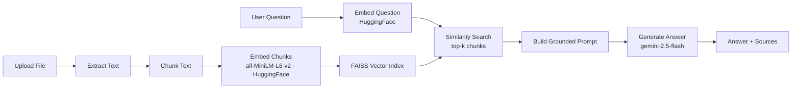

# 📄 DocuChat AI - Retrieval-Augmented Q&A over Your Documents

A Retrieval-Augmented Generation (RAG) app that lets you upload a document (`.txt`, `.pdf`, `.docx`, `.csv`, `.xlsx`) and ask questions about it in a chat interface. Answers are grounded strictly in the document's content, with the exact source chunks shown for every response.

**🔗 Live demo:** [docuchat-ai-rag.streamlit.app](https://docuchat-ai-rag.streamlit.app/)

---

## ✨ Features

- **Multi-format support** - plain text, PDF, Word, CSV, and Excel files
- **Chat-style interface** with full conversation history
- **Transparent retrieval** - every answer shows the exact chunks it was grounded in, with similarity distance
- **Smart chunking** - tabular data (CSV/XLSX) uses larger, low-overlap chunks to keep rows intact; prose uses smaller, denser chunks for tighter semantic matches
- **Session-level caching** - a document is embedded once per session; asking follow-up questions doesn't re-embed the same file
- **Resilient embeddings** - automatic retry with backoff on transient API failures
- **Two independent API quotas** - embeddings (HuggingFace) and generation (Gemini) run on separate services, so one running out of quota doesn't take the whole app down
- **Clear failure states** - missing API keys, unsupported file type, or empty document all produce readable errors instead of crashes

---

## 🏗️ Architecture



**Pipeline stages:**

1. **Ingestion** - `file_loader.py` extracts raw text from the uploaded file.
2. **Chunking** - the text is split into overlapping windows (size depends on file type).
3. **Embedding** - each chunk is converted into a dense vector via a HuggingFace-hosted sentence-transformer.
4. **Indexing** - vectors are stored in an in-memory FAISS `IndexFlatL2` store.
5. **Retrieval** - the user's question is embedded and matched against the top-k closest chunks.
6. **Generation** - Gemini's `gemini-2.5-flash` answers using only the retrieved chunks as context.

---

## 📁 Project Structure

```
docuchat-ai/
├── app.py                          # Streamlit UI (entry point)
├── rag_engine.py                   # Core RAG logic: chunk / embed / index / retrieve / generate
├── file_loader.py                  # Text extraction for txt/pdf/docx/csv/xlsx
├── requirements.txt
├── LICENSE
├── .gitignore
└── .streamlit/
    ├── config.toml                 # Theme
    └── secrets.toml.example        # Template — copy to secrets.toml, never commit the real one
```

Separating the engine from the UI means the RAG logic can be reused in a CLI tool, a notebook, or a different frontend without touching a single Streamlit call.

---

## 🚀 Running Locally

**1. Clone and install dependencies**

```bash
git clone https://github.com/HananAIBuilds/docuchat-ai.git
cd docuchat-ai
python -m venv venv
source venv/bin/activate      # Windows: venv\Scripts\activate
pip install -r requirements.txt
```

**2. Add your API keys**

```bash
cp .streamlit/secrets.toml.example .streamlit/secrets.toml
# then edit .streamlit/secrets.toml and paste your keys
```

You'll need two free-tier keys:
- **Google API key** - [Google AI Studio](https://aistudio.google.com/apikey) (used for answer generation)
- **HuggingFace token** - [huggingface.co/settings/tokens](https://huggingface.co/settings/tokens) (used for embeddings)

**3. Run the app**

```bash
streamlit run app.py
```

---

## ☁️ Deploying to Streamlit Cloud

1. Push this repo to GitHub (make sure `.streamlit/secrets.toml` is **not** committed, it's already in `.gitignore`).
2. Go to [share.streamlit.io](https://share.streamlit.io) → **New app** → select your repo, branch, and `app.py` as the entry point.
3. Under **Advanced settings → Secrets**, paste:
   ```toml
   GOOGLE_API_KEY = "your-google-api-key-here"
   HF_TOKEN = "your-huggingface-token-here"
   ```
4. Deploy.

---

## ⚠️ Design Decisions & Known Limitations

**Why embeddings run on HuggingFace instead of Gemini.** The first version used Gemini's own embedding model for both embeddings and generation, sharing a single API key and quota. In practice, embeddings burn through a quota far faster than generation does — every chunk of every uploaded document needs its own embedding call, on top of one more call per question asked. Once that shared quota was exhausted on the live deployment, the entire app stalled: no embeddings meant nothing to search, which meant no answers — even though the generation quota itself was untouched. Embeddings were moved to a HuggingFace-hosted sentence-transformer (`all-MiniLM-L6-v2`), which is free with its own separate rate limit. Now the two steps fail independently instead of one quota outage taking down the whole pipeline. Generation stays on Gemini's `gemini-2.5-flash`, since that was never the bottleneck.

**Not built for counting/aggregation.** RAG retrieves only the top-k most relevant chunks — never the whole document. A question like *"how many rows have value X?"* will only reflect the rows inside the retrieved chunks, not the full dataset. This tool is best suited for *"find this specific fact"* questions, not full-dataset statistics.

**Processing time scales with file size.** Each chunk requires one embedding call; very large documents take longer to process.

**In-memory index.** The FAISS index lives in the Streamlit session, it resets if the app restarts or the session ends. There's no persistent vector database (yet).

**Answer quality depends on retrieval quality.** If the top-k chunks don't contain the answer, the model is instructed to say so rather than guess — but retrieval isn't perfect.

---

## 🧰 Tech Stack

| Layer | Tool |
|---|---|
| UI | Streamlit |
| Embeddings | HuggingFace `sentence-transformers/all-MiniLM-L6-v2` |
| Generation | Google Gemini (`gemini-2.5-flash`) |
| Vector search | FAISS (`IndexFlatL2`) |
| File parsing | `pypdf`, `python-docx`, `openpyxl`, `csv` |

---

## 🗺️ Possible Next Steps

- Swap the in-memory FAISS index for a persistent vector DB (e.g. Chroma, Pinecone) to support multi-session use
- Add multi-file / multi-document support with per-file source attribution
- Add a lightweight aggregation path (e.g. pandas-based) for structured files so counting questions can be answered exactly, alongside the semantic RAG path
- Add automated tests around chunking edge cases and file parsing

---

## 📜 License

MIT - see [LICENSE](LICENSE).
